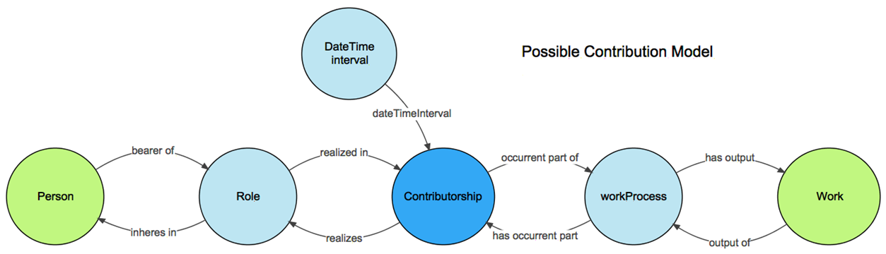

# RDA/TDWG Attribution Metadata Working Group: Final Recommendations
## Executive Summary
Research collections are an important tool for understanding the Earth, its systems, and human interaction. Despite the importance of collections, many are not maintained or curated as thoroughly as they should. Part of the reason for this is the lack of professional reward for curatorial actions. To address this gap in attribution metadata, this Working Group recommends the use of PROV entities and properties to link people (Agent), the curatorial actions they perform (Activity), and the digital or physical objects they are curating (Entity). Assigning a Role to an Agent is optional. These recommendations are discussed in the context of the RDA and existing standards. A separate technical document gives specific examples of three use cases as RDF Turtle representations and diagrams.
## Introduction
### Background and Rationale
Research collections are an important tool for understanding the Earth, its systems, and human interaction. These collections are very diverse and can include preserved natural history specimens, archeological artifacts, or historical documents, to name just a few. Maintaining and curating these collections requires a large investment of time and money by institutions and many individuals. Knowledge is created from collections by many individuals over time, building on the work of others. For maximum efficiency, work needs to be shared broadly, recorded permanently, and tasks not repeated unnecessarily. Unfortunately, the current research cyberinfrastructure does not support this level of efficiency.
 
Despite the importance of collections, many are not maintained or curated as thoroughly as they should. Part of the reason for this is the lack of professional reward for curatorial actions. Most of the researchers who are qualified to curate a collection are too busy performing activities that will reap professional reward, such as publication and grant-writing.  Proper methods of attribution (at the individual and institutional level) are very important for incentivizing digitization, mobilization, and sharing of data deriving from collections (physical and digital). One strategy for incentivizing physical and digital collection curation is to create infrastructure for attributing curatorial actions. Several programs exist for aggregating metrics for research products other than publication, such as [ImpactStory](http://impactstory.org/), [OpenVIVO](http://openvivo.org/), [Collector](http://collector.shorthouse.net/), and [Altmetrics](https://www.altmetric.com/). Thus, there is already infrastructure in place for aggregating these data, if the e-infrastructure for creation of these data is available.
 
Significant investment has been made in creating infrastructure components for data integration across a wide variety of disciplines. Many of these components are lists, repositories, or other structures that must be populated with data either by a person or algorithmically. Even an automatically-created data set will require some degree of human curation to ensure quality. Often, very little can be completed without initial work by a person to create reference material. This human-component is a major bottleneck. Thus, existing infrastructure for collective resources are not being populated with data and thus are not maximally useful. One way to widen the bottleneck is to create professional incentives for researchers to contribute to maintaining and curating collections. If people could get professional credit for making updates to a classification database, for example, it could become a higher priority for them to dedicate the time required. The problem is that there is no good way to manage information about curatorial actions so that curators can get professional credit.
 
The goal of this WG was to develop recommendations for an attribution data schema that can make getting credit for curation, maintenance, and digitization of a collection as easy as getting credit for a publication. These recommendations are presented below, in the “Results” section.
### Scope
These recommendations were developed to record the attribution metadata associated with curation and maintenance of research collections, whether they be physical or digital objects. The schema was designed to be adopted as part of existing data models and workflows used by stewards of these collections, e.g. museums. It assumes that there is already in place within the institution a collections management system including a system of identifiers for tracking research objects in the collection and curators. These recommendations are intended to fit within the context of existing, domain-specific vocabularies for recording various types of metadata, which will be presented in the “Discussion and Conclusions” section. 
## Results
### Recommended Schema
This Working Group recommends a very basic, three-axiom, schema based on PROV entities and properties shown in the diagram below (and demonstrated in the [PROV-O documentation](https://www.w3.org/TR/prov-o/#qualified-terms-figure)):


The key elements of the model for attribution are:

```
Entity wasGeneratedBy Activity
Activity wasAssociatedWith Agent
Association hadRole Role
```

with some additional attributes assigned to the Activity class:

```
Activity has attribute DateTime
Activity has attribute Reason (added as comment)
```

The Entity is the curated data object, whether it be a piece of metadata or a physical object. The Activity is the actual curation activity, such as making a correction or transformation. The Agent is the person performing the curation activity. Every Activity will have a DateTime stamp and a Reason it was performed (optional). The above axioms state that an Entity “wasGeneratedBy” an Activity. The Activity “wasAssociatedWith” an Agent, who performed the Activity. An Activity can be related to an Agent using one of two properties. The first is “wasAssociatedWith” and the second, “qualifiedAssociation”, allows for the assignment of a Role. Assigning a Role to the Agent is optional; if no role is to be assigned, then “wasAssociatedWith” should be used. This ontology design pattern is very similar to work done by Cox and Car (2015).

Each specific Entity, Activity, and Agent should be represented by a unique, persistent identifier (McMurry et al. 2017). We recommend the use of IGSN for physical objects, ORCID for people, and DOI for digital objects wherever possible. The adoption of IGSN for biological specimens is still being discussed and these recommendations will defer to the future community decision. Activities can be identified internal to the curation management system in place. All Activities, Entities, and Agents should be instances of a PROV Activity class, a PROV Entity class, and a PROV Agent class, respectively. If the appropriate class does not exist as a subclass, users should work with the VIVO community to request the new VIVO subclass which can be mapped to PROV. DateTime should be represented as xsd (CCYY-MM-DDThh:mm:ss[Z|(+|-)hh:mm]). Each discipline should use the identifiers and representations that work best within their community of practice.
### Justification
The above recommendations are based on an existing ontology, PROV, that is part of a broader world of interconnected ontologies and vocabularies that are in use and have active community support. The pattern is simple enough to be repurposed in multiple disciplines and on physical and digital objects, yet still conforms to existing semantic frameworks. 

This schema supports the following queries identified as important by the use cases:
* Show me all the Activities performed by an Agent in this time period.
* What Activities have been performed on this Entity? When?
* Which Agents have worked with this Entity?
* What Role did the Agent play in the Activity?

### Example from Use Cases
Example RDF Turtle representations and diagrams of three use cases are given in the technical document. Examples of how these recommendations could fit in with the larger landscape of existing relevant ontologies and vocabularies are also represented.
## Discussion and Conclusion
### Relationship to Other RDA Recommendations
#### Metadata Standards Catalog and Metadata Standards Directory WGs and Metadata IG
The Metadata WGs developed a list of five metadata principles to which these recommendations adhere. 

The Metadata IG developed a Metadata Element Set, which is a list of broad categories of metadata types. This IG has asked that all WG make sure their recommendations are represented in the Metadata Element Set. The table below maps the elements in these recommendations with the Metadata Element Set.

|Element in Recommendations|Metadata Element Set|Notes|
|--------------------------|--------------------|-----|
|Unique identifiers|Unique Identifier or Location|Falls under location if resolvable HTTP URIs are used.|
|DateTime|Temporal Coordinates||
|URIs for Entities and Properties|Location|If resolvable HTTP URIs are used.|
|Agent|Originator, Unique Identifier, or Location|If resolvable HTTP URIs are used.|
|Activity, Entity, Agent|Provenance||

All of the metadata elements in these recommendations are represented in the Metadata Element Set, some under more than one Element. For example, Agents could be part of the Originator element, the Unique Identifier element, or the Location element (if the unique identifier is a resolvable HTTP URI).

The metadata standards we use in our recommendations are all a part of the metadata catalog that these groups have produced. This WG has participated in the discussion of the present elements on the collaborative documents that have been created by the Metadata groups.
#### Research Data Provenance IG and Provenance Patterns WG
Tracking provenance for research data is vital to science and scholarship, providing answers to common questions researchers and institutions pose when sharing and exchanging data. Attribution for curatorial activities is an important part of provenance. Our WG had many use cases of interest to the Provenance Patterns WG.

The tasks for the Provenance Patterns Working Group focus on finding, detailing and recommending best practices for provenance representation and management.  The Use Cases developed as part of the RDA/TDWG Metadata Attribution WG have been shared with the Provenance Patterns WG, to be hosted in their use case database.  This will make them easier to find by the broader provenance research community.  The Provenance Patterns Working Group has additionally based a solution pattern on the agent role use case, and will continue drawing on the Attribution Metadata WG use cases in their work going forward.

#### ICSU-WDS & RDA Publishing Data Services WG
This WG developed [recommendations](https://b2share.eudat.eu/records/be5907a5e637401abdae7d39f34dfaab) for linking publications with data using SCHOLIX and the OpenAire DLI service. The recommendations take advantage of DataCite, CrossRef, and RMap. While these recommendations do not directly overlap with the recommendations of this group, linking Activities and Entities to publications is important. We recommend taking full advantage of the recommendations of Publishing Data Services WG when linking a digital Entity to a publication. More work is needed to define links between Activities and publications.
#### Use Cases Group
The RDA Use Cases Group collects all the use cases developed by the different RDA WG and IG. The use cases developed by this WG have been included in this listing.
#### Physical Samples and Collections in the Research Data Ecosystem IG
This IG is dedicated to finding solutions for integrating physical samples in an increasingly digital research environment. This includes the linking of specimens to publications, data, and metadata about the specimen. Since this is an IG, there are no recommendations planned, but discussion of persistent, unique identifiers and the development of a metadata schema for describing physical samples is important. Our recommendations include the use of IGSN numbers for identifying specimens. IGSN allows for links to data and publications through the relatedIdentifier property.
### Relationship to Existing Standards
*PROV-O: An ontology for describing provenance.* These recommendations use design patterns from this ontology, ensuring compatibility. The use of PROV means that these recommendations are compatible with VIVO and BCO. Users can use entities and properties in PROV, VIVO, and BCO to suit specific provenance needs that are out of scope for these recommendations. For example, linking a transformed image to its original image can be done using PROV derivedFrom.

*SESAR/IGSN: A system of identifiers and metadata for physical samples.* These recommendations include the use of IGSN as identifiers for physical objects where possible. IGSN provides for recording the collector of a sample. The use of IGSN for biological specimens is still being discussed within the biodiversity community. 

*TaDiRAH: A vocabulary focused on digital research in the Humanities.* This vocabulary contains relevant terms such as “Annotating”, “Cleanup”, and “Editing” that could be used as an Activity, but is specific to the Humanities. Users should draw terms from a relevant vocabulary or add the terms they need to an existing vocabulary. 

*CRediT: A vocabulary of contributor roles in research.* CRediT is a high-level researcher role vocabulary supported by CASRAI. If a Role is to be assigned to an Agent, it should come from a controlled vocabulary, such as CRediT; however CRediT is very high-level and may not have the needed terms. Users should draw terms from a relevant vocabulary or add the terms they need to an existing vocabulary.

*OpenRIF/VIVO-ISF: An ontology for representing contributor roles, activities, and relationships in clinical research.* VIVO is compatible with PROV. VIVO might be a good adopter if “Curation” is added as a subclass of “Process”. One important point to remember is that PROV is a W3C recommendation, while VIVO is an OBOFoundry ontology. The critical difference between PROV and VIVO is in the Role class. In VIVO, the Role is unique to the Agent while in PROV, the Role is a separate class that can be assigned to multiple Agents. The consequences of choosing PROV or VIVO should be carefully weighed by each adopter, but will be less of an issue if Role is not used. A PROV Agent would be equivalent to a Person, Group, or Organization in VIVO (or rather, a FOAF Agent). A PROV Activity would be equivalent to an Event from the event ontology. A PROV Entity would be any OWL Thing. Below is an attribution model proposed, but not yet implemented, in VIVO.



The person (or Agent) is the bearer of a Role which may have any of the CRediT types.  The Role is realizedIn an occurrentPart (here called Contributorship and not directly represented in the recommendation) of a workProcess (or Activity) which has output Work (or Entity).  The person “participates_in” (RO_0000056) the work process (not shown).  A datetime can be added to the contributorship to constrain the time of a person’s contribution as shown above, but also to the work process to indicate start and end times for that process (not shown).

*Darwin Core: A data standard for biodiversity.* Darwin Core does not currently have an extension for describing curation of objects. This recommendation will form the foundation of future work to develop this extension.

*COPDESS: Data publication standards in Earth Science.* COPDESS has committed to using IGSN and ORCID, as these recommendations suggest.
Data Cite: Data publication standards. Data Cite only allows use of DOI. These recommendations suggest using DOI for digital objects where possible.

*Biological Collections Ontology (BCO): Ontology for describing the collection and treatment of biological samples.* This ontology describes some activities that could be considered curatorial, such as the analysis and treatment of biological samples, but is less concerned about attributing those actions to an individual. BCO and PROV are compatible. Many of the process classes in BCO could serve as Activities in PROV.
### Adopters
Museums, repositories, and other stewards of collections are always working hard to maintain and curate their collections for maximum use. This WG will be pursuing these institutions as adopters and working closely with them to investigate large-scale viability of solutions they have implemented as well as ensuring WG deliverables will be useful to them. Our first tier of adopters include iDigBio and the Natural History Museum London, both of which have been involved in the development of these recommendations.

In order to have a true impact on the social aspect of professional reward, the WG deliverables need to ensure that data within the schema can be used by professional metrics aggregators such as ImpactStory. We will work closely with this project as a second tier adopters to make sure that their system can handle our products delivered to them by our tier one adopters. One important difference between this WG and other efforts is the focus on outputs that result in actionable metrics.

Full implementation of these recommendations by adopters will likely require addition of subclasses to the VIVO ontology.
## References
Cox and Car. 2015. PROV and real things. 21st International Congress on Modelling and Simulation (MODSIM2015) Queensland, Australia. 

McMurry JA, Juty N, Blomberg N, Burdett T, Conlin T, Conte N, et al. 2017. Identifiers for the 21st century: How to design, provision, and reuse persistent identifiers to maximize utility and impact of life science data. PLoS Biol 15(6): e2001414. https://doi.org/10.1371/journal.pbio.2001414
