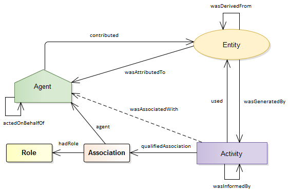
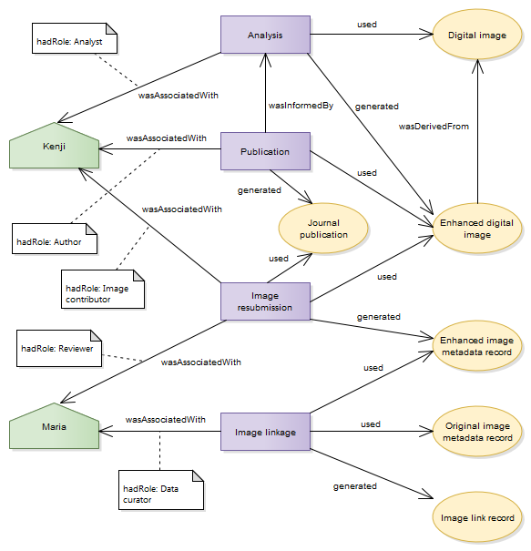

# Attribution Metadata Standard and Use Case Examples
*RDA / TDWG Metadata Standards for Attribution of Physical and Digital Collections Stewardship Working Group*
## Provenance, PROV and attribution
The PROV-DM data model [documentation](https://www.w3.org/TR/prov-dm/) defines provenance as “information about entities, activities, and people involved in producing a piece of data or thing, which can be used to form assessments about its quality, reliability or trustworthiness”.  If we consider attribution to be giving credit to a person for their contribution to an activity, then it seems a logical extension for attribution to represent a subsection of the provenance model.

The PROV ontology ([PROV-O](https://www.w3.org/TR/prov-o/)) uses a set of classes, properties and restrictions to express the PROV-DM data model for representing provenance information.  The core of the ontology uses three starting point classes (Agent, Entity and Activity) which are joined by a set of related properties *(Figure 1)*.


*Figure 1: The three PROV starting point classes and relating properties 
([PROV-O: The PROV ontology](http://www.w3.org/TR/prov-o/))*

Contributor roles in PROV can be modelled as a property of the association between an agent and an activity.  While the **prov:wasAssociatedWith** starting point property asserts a relation between an agent and an activity, the role of the agent in that activity is not explicit in that relation, and this issue is further exacerbated when multiple agents are associated with an activity.  

However, PROV also provides the **prov:qualifiedAssociation** qualified property, which can be used to add more details about the binary relation between an agent and an activity.  By using the **prov:Role** class to define a role, and the **prov:hadRole** property to link the role to a qualified association, an explicit definition of the role played by an agent in an activity can be represented *(Figure 2)*.



*Figure 2: Using the qualifiedAssociation property to specify agent roles in an activity 
([PROV-O: The PROV ontology](http://www.w3.org/TR/prov-o/))*

These elements form a core structure for describing attribution, and each class can be expanded to include additional relevant information such as times, activity reasons and contexts and identifiers for different types of agents and entities.  

For the sake of simplicity, the use cases in this document are focused on demonstrating the attribution elements of the model, rather than providing a detailed representation of provenance.  For the same reason, there are minimal inclusions of other existing ontologies and vocabularies which might be used to extend the attributes of the PROV classes and properties.

However, the core model can easily be built upon by mapping other specialised ontologies and controlled vocabularies to the PROV classes *(Figure 3)*, and there is scope within PROV for far more granular and explicit representations using the various subclasses, qualified properties and expanded terms as required.


*Figure 3: Examples of linking the core attribution model in PROV to specialised and domain ontologies and controlled vocabularies*

## Attribution use cases
For the purposes of demonstrating the use of the PROV ontology to represent attribution, we have focused on three use cases based on those submitted to the working group. Each is shown in diagrammatic form and RDF/Turtle format.  
### Use case 1: Digital record curation
Michael (a researcher) notices that a specimen has an incorrect digital lat/long record.  Michael reports the error to Sarah (a data curator), who corrects the record in the database.

**Attribution:**
* Michael should receive attribution for reporting the error
* Sarah should receive attribution for correcting the digital record


**RDF/Turtle representation**
```
@prefix :	<http://example.org/> .
@prefix dct: 	<http://purl.org/dc/terms/> .
@prefix rdf: 	<http://www.w3.org/1999/02/22-rdf-syntax-ns#> .
@prefix xsd:  	<http://www.w3.org/2001/XMLSchema#> .
@prefix rdfs: 	<http://www.w3.org/2000/01/rdf-schema#> .
@prefix prov: 	<http://www.w3.org/ns/prov#> .
@prefix foaf: 	<http://xmlns.com/foaf/0.1/> .
@prefix vivo: 	<http://vivoweb.org/ontology/core#> .

:activityReason a rdfs:Class .

:michael
    a prov:Person, prov:Agent ;
    foaf:givenName 	"Michael" ;
    vivo:orcidId	"http://orcid.org/NNNN-NNNN-NNNN-NNNN" ;
.

:sarah
    a prov:Person, prov:Agent ;
    foaf:givenName 	"Sarah" ;
    vivo:orcidId	"http://orcid.org/NNNN-NNNN-NNNN-NNNN" ;
.

:error_reporter 
    a prov:Role ;
.

:record_editor 
    a prov:Role ;
    # credit:contributor_role <http://dictionary.casrai.org/Contributor_Roles/Data_curation> ;
.

:incorrect_lat_long_record
    a prov:Entity ;
    prov:Value     “-89.747988,43.138092” ;
    dct:references <https://doi.org/XX.XXXX/XXXXXXX> ;
.

:correct_lat_long_record
    a prov:Entity ;
    dct:references 	   <https://doi.org/XX.XXXX/XXXXXXX> ;
    prov:Value           “43.138092,-89.747988” ;
    prov:wasRevisionOf   :incorrect_lat_long_record ;
.

:correction
    a prov:Activity ;
    prov:startedAtTime 	"2012-04-15T13:00:00-04:00"^^xsd:dateTime ;
    prov:endedAtTime 		"2012-04-15T13:00:00-04:00"^^xsd:dateTime ;
    prov:used			:incorrect_lat_long_record ;
    prov:generated		:correct_lat_long_record ;
    prov:wasAssociatedWith	:michael ;
    prov:wasAssociatedWith	:sarah ;
    :activityReason		"Incorrect longitude and latitude on the digital record." ;
		
    prov:qualifiedAssociation [
        a prov:Association ;
        prov:agent   :michael ;    
        prov:hadRole :error_reporter ; 
    ];

    prov:qualifiedAssociation [
        a prov:Association ;
        prov:agent   :sarah ;    
        prov:hadRole :record_editor ; 
    ] ;
.
```
### Use case 2: Digital media generation and linkage
Kenji (a researcher) carries out an analysis using a digital image from a public repository.  As a result of that process, he produces an enhanced copy of the original image. Kenji uses the enhanced image in a journal publication, and also submits the new image back to the public repository, including a reference to the published paper.  The image submission process automatically generates an accompanying image metadata record in the repository database.

Maria (a data curator) reviews the submitted image, and realises that it is related to the original image.  She uses the database interface to create a link between the original image metadata record and the enhanced image metadata record.

**Attribution:** 

* Kenji should receive attribution for:
    * running the analysis which generates the enhanced image
    * authoring the journal paper which uses the enhanced image
    * submitting the enhanced image back to the repository
 
* Maria should receive attribution for:
    * reviewing the submitted image and detecting that it was related to the original image
    * linking the original image to the enhanced image in the repository database



**RDF/Turtle representation**
```
@prefix :	<http://example.org/> .
@prefix dct: 	<http://purl.org/dc/terms/> .
@prefix rdf: 	<http://www.w3.org/1999/02/22-rdf-syntax-ns#> .
@prefix xsd:  	<http://www.w3.org/2001/XMLSchema#> .
@prefix rdfs: 	<http://www.w3.org/2000/01/rdf-schema#> .
@prefix prov: 	<http://www.w3.org/ns/prov#> .
@prefix foaf: 	<http://xmlns.com/foaf/0.1/> .
@prefix vivo: 	<http://vivoweb.org/ontology/core#> .

:activityReason a rdfs:Class .

# Agents

:kenji
    a prov:Person, prov:Agent, dct:Agent ;
    foaf:givenName 	"Kenji";
    vivo:orcidId	"http://orcid.org/NNNN-NNNN-NNNN-NNNN" ;
.

:maria
    a prov:Person, prov:Agent;
    foaf:givenName 	"Maria";
    vivo:orcidId	"http://orcid.org/NNNN-NNNN-NNNN-NNNN" ;
.

# Contributor roles

:analyst a prov:Role .

:author a prov:Role .

:image_contributor a prov:Role .

:reviewer a prov:Role .

:data_curator a prov:Role .

# Entities

:digital_image
    a prov:Entity ;
    dct:references <https://doi.org/XX.XXXX/XXXXXXX> ;
.

:enhanced_digital_image
    a prov:Entity ;
    dct:references 	    <https://doi.org/XX.XXXX/XXXXXXX> ;
    prov:wasDerivedFrom   :digital_image ;
.

:journal_publication
    a prov:Entity ;
    dct:references <https://doi.org/XX.XXXX/XXXXXXX> ;
.

:original_image_metadata_record
    a prov:Entity ;
    dct:references <https://doi.org/XX.XXXX/XXXXXXX> ;
.

:enhanced_image_metadata_record
    a prov:Entity ;
    dct:references 	    <https://doi.org/XX.XXXX/XXXXXXX> ;
.

:image_link_record
    a prov:Entity ;
    dct:references <https://doi.org/XX.XXXX/XXXXXXX> ;
.

# Activities

:analysis
    a prov:Activity ;
    prov:startedAtTime 	"2012-04-15T13:00:00-04:00"^^xsd:dateTime ;
    prov:endedAtTime 		"2012-04-15T13:00:00-04:00"^^xsd:dateTime ;
    prov:used			:digital_image ;
    prov:generated		:enhanced_digital_image ;
    prov:wasAssociatedWith	:kenji ;
    :activityReason		"Image analysis for research paper." ;
		
    # Role association
    prov:qualifiedAssociation [
        a prov:Association ;
        prov:agent   :kenji ;    
        prov:hadRole :analyst ; 
    ];
.

:publication
    a prov:Activity ;
    prov:startedAtTime        "2012-04-15T13:00:00-04:00"^^xsd:dateTime ;
    prov:endedAtTime 		"2012-04-15T13:00:00-04:00"^^xsd:dateTime ;
    prov:wasInformedBy		:analysis ;
    prov:used			:enhanced_digital_image ;
    prov:generated		:journal_publication ;
    prov:wasAssociatedWith    :kenji ;
    :activityReason		"Publication of image analysis results." ;
		
    # Role
    prov:qualifiedAssociation [
        a prov:Association ;
        prov:agent   :kenji ;    
        prov:hadRole :author ; 
    ] ;
.

:image_resubmission
    a prov:Activity ;
    prov:startedAtTime 	"2012-04-15T13:00:00-04:00"^^xsd:dateTime ;
    prov:endedAtTime 		"2012-04-15T13:00:00-04:00"^^xsd:dateTime ;
    prov:used			:journal_publication ;
    prov:used			:enhanced_digital_image ;	
    prov:generated		:enhanced_image_metadata_record ;
    prov:wasAssociatedWith    :kenji ;
    :activityReason		"Contribution of enhanced derived image back to the repository." ;
		
    # Roles
    prov:qualifiedAssociation [
        a prov:Association ;
        prov:agent   :kenji ;    
        prov:hadRole :image_contributor ; 
    ] ;

    prov:qualifiedAssociation [
        a prov:Association ;
        prov:agent   :maria ;    
        prov:hadRole :reviewer ; 
    ] ;
.

:image_linkage
    a prov:Activity ;
    prov:startedAtTime      "2012-04-15T13:00:00-04:00"^^xsd:dateTime ;
    prov:endedAtTime        "2012-04-15T13:00:00-04:00"^^xsd:dateTime ;
    prov:used		     :enhanced_image_metadata_record ;
    prov:used		     :original_image_metadata_record ;	
    prov:generated	     :image_link_record ;
    prov:wasAssociatedWith  :maria ;
    :activityReason	     "Linking the enhanced version of the image with the original image." ;
		
    # Role
    prov:qualifiedAssociation [
        a prov:Association ;
        prov:agent   :maria ;    
        prov:hadRole :data_curator ; 
    ] ;
.
```
### Use case 3: Physical and digital specimen curation
Sergey (a museum curator) recurates a jar containing multiple specimens. Each specimen is removed from the jar and individually mounted.  Sergey then examines the specimen and jar label, and enters a new record into the collections management database.  He uses the data in the new record to generate a new label to attach to the physical specimen.

Sergey also, in the process of recurating one of the specimens, discovers a new species.  He describes the new species, and uses the species description to publish a journal paper.

**Attribution:**

* Sergey should receive attribution for:
    * recurating the physical specimens
    * describing the new species
    * authoring the journal article
    * entering the specimen into the collections management database
    * generating a label for the re-curated specimen


**RDF/Turtle representation**
```
@prefix :	<http://example.org/> .
@prefix dct: 	<http://purl.org/dc/terms/> .
@prefix rdf: 	<http://www.w3.org/1999/02/22-rdf-syntax-ns#> .
@prefix xsd:  	<http://www.w3.org/2001/XMLSchema#> .
@prefix rdfs: 	<http://www.w3.org/2000/01/rdf-schema#> .
@prefix prov: 	<http://www.w3.org/ns/prov#> .
@prefix foaf: 	<http://xmlns.com/foaf/0.1/> .
@prefix vivo: 	<http://vivoweb.org/ontology/core#> .

:activityReason a rdfs:Class .

# Agents

:sergey
	a prov:Person, prov:Agent, dct:Agent ;
	foaf:givenName 	"Sergey";
	vivo:orcidId	"http://orcid.org/NNNN-NNNN-NNNN-NNNN" ;
.

# Contributor roles

:specimen_curator a prov:Role .

:taxonomist a prov:Role .

:label_author a prov:Role .

:author a prov:Role .

:data_curator a prov:Role .

# Entities

:jar_of_specimens
    a prov:Entity ;
    # lot identifier needed (museum registration no.?)
.

:individual_specimen
    a prov:Entity ;
    prov:wasDerivedFrom :jar_of_specimens ;
    # specimen identifier needed
.

:specimen_label
    a prov:Entity ;
.

:species_description
    a prov:Entity ;
.

:journal_publication
    a prov:Entity ;
    dct:references 	<https://doi.org/XX.XXXX/XXXXXXX> ;
.

:digital_specimen_record
    a prov:Entity ;
    dct:references 		<https://doi.org/XX.XXXX/XXXXXXX> ;
.

# Activities

:recuration
    a prov:Activity ;
    prov:startedAtTime 	"2012-04-15T13:00:00-04:00"^^xsd:dateTime ;
    prov:endedAtTime 		"2012-04-15T13:00:00-04:00"^^xsd:dateTime ;
    prov:used			:jar_of_specimens ;
    prov:generated		:individual_specimen ;
    prov:wasAssociatedWith	:sergey ;
    :activityReason		"Sorting, identification and recuration of multiple specimens in a jar." ;
		
    # Role association
    prov:qualifiedAssociation [
        a prov:Association ;
        prov:agent   :sergey ;    
        prov:hadRole :specimen_curator ; 
   ];
.

:description
    a prov:Activity ;
    prov:startedAtTime 	"2012-04-15T13:00:00-04:00"^^xsd:dateTime ;
    prov:endedAtTime 		"2012-04-15T13:00:00-04:00"^^xsd:dateTime ;
    prov:used			:individual_specimen ;
    prov:generated            :species_description ;
    prov:wasAssociatedWith	:kenji ;
    :activityReason		"Publication of image analysis results." ;
		
    # Role
    prov:qualifiedAssociation [
        a prov:Association ;
        prov:agent   :sergey ;    
        prov:hadRole :taxonomist ; 
    ] ;
.

:publication
    a prov:Activity ;
    prov:startedAtTime 	"2012-04-15T13:00:00-04:00"^^xsd:dateTime ;
    prov:endedAtTime 		"2012-04-15T13:00:00-04:00"^^xsd:dateTime ;
    prov:wasInformedBy		:description ;
    prov:used                 :species_description ;
    prov:generated		:journal_publication ;
    prov:wasAssociatedWith	:sergey ;
    :activityReason		"Description of a new species." ;
		
    # Role
    prov:qualifiedAssociation [
        a prov:Association ;
        prov:agent   :sergey ;    
        prov:hadRole :author ; 
    ] ;
.

:databasing
    a prov:Activity ;
    prov:startedAtTime 	"2012-04-15T13:00:00-04:00"^^xsd:dateTime ;
    prov:endedAtTime 		"2012-04-15T13:00:00-04:00"^^xsd:dateTime ;
    prov:wasInformedBy		:description ;
    prov:generated		:digital_specimen_record ;
    prov:wasAssociatedWith	:sergey ;
    :activityReason		"Creating a specimen-level record in the collections database." ;
		
    # Role
    prov:qualifiedAssociation [
    a prov:Association ;
    prov:agent   :sergey ;    
    prov:hadRole :data_curator ; 
    ] ;
.

:labelling
    a prov:Activity ;
    prov:startedAtTime 	"2012-04-15T13:00:00-04:00"^^xsd:dateTime ;
    prov:endedAtTime 		"2012-04-15T13:00:00-04:00"^^xsd:dateTime ;
    prov:used			:digital_specimen_record ;
    prov:generated		:specimen_label ;
    prov:wasAssociatedWith	:sergey ;
    :activityReason		"Generating a new label for the recurated specimen." ;
		
    # Role
    prov:qualifiedAssociation [
        a prov:Association ;
        prov:agent   :sergey ;    
        prov:hadRole :label_author ; 
    ] ;
.
```
